# Cloudflare WAF Security Operations Lab

This project shows how I protected a test web application with Cloudflare and practiced common WAF operations. I created and tested several security rules, reviewed the resulting events, investigated and corrected false-positive blocks, and used Terraform to manage the Cloudflare WAF ruleset as code.

All testing was authorized and performed only against my own lab application.

---

## What This Lab Demonstrates

### Cloudflare WAF Operations

- Onboarded the application
- Configured XSS and SQLi rules
- Configured rate limiting
- Tested allowed and blocked traffic
- Tuned the XSS rule after identifying a false positive
- Used Burp Suite for controlled testing

### Terraform + Cloudflare WAF

- Installed and configured Terraform
- Authenticated securely to Cloudflare
- Represented a WAF rule as code
- Previewed the change with `terraform plan`
- Deployed and verified the change
- Demonstrated Infrastructure as Code (IaC) change management

---

## Environment

- Cloudflare WAF and Security Analytics
- Local test web application
- Cloudflare Tunnel
- Burp Suite Community Edition
- Terraform with the Cloudflare provider
- Visual Studio Code on macOS

---

## How the Lab Works

```text
Browser or Burp Suite
        |
        v
Cloudflare DNS, Tunnel, and WAF
        |
        v
Local test application

Terraform ---> Cloudflare API ---> WAF rules
```

Cloudflare Tunnel made the local application available at `app.aliawaflab.com`. This allowed requests to pass through Cloudflare before reaching the application.

---

## Project Walkthrough

### Phase 1 – Domain Setup

I registered `aliawaflab.com` and confirmed that Cloudflare was protecting the domain.

📸 [View domain setup screenshots](Evidence/Polished/01-domain-setup)

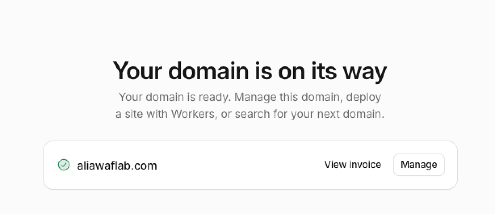

---

### Phase 2 – Application Onboarding

I started a simple local test application and checked that it worked. I then used Cloudflare Tunnel to publish it at `app.aliawaflab.com`.

📄 [View the test application](app/app.py)

📸 [View application onboarding screenshots](Evidence/Polished/02-application-onboarding)

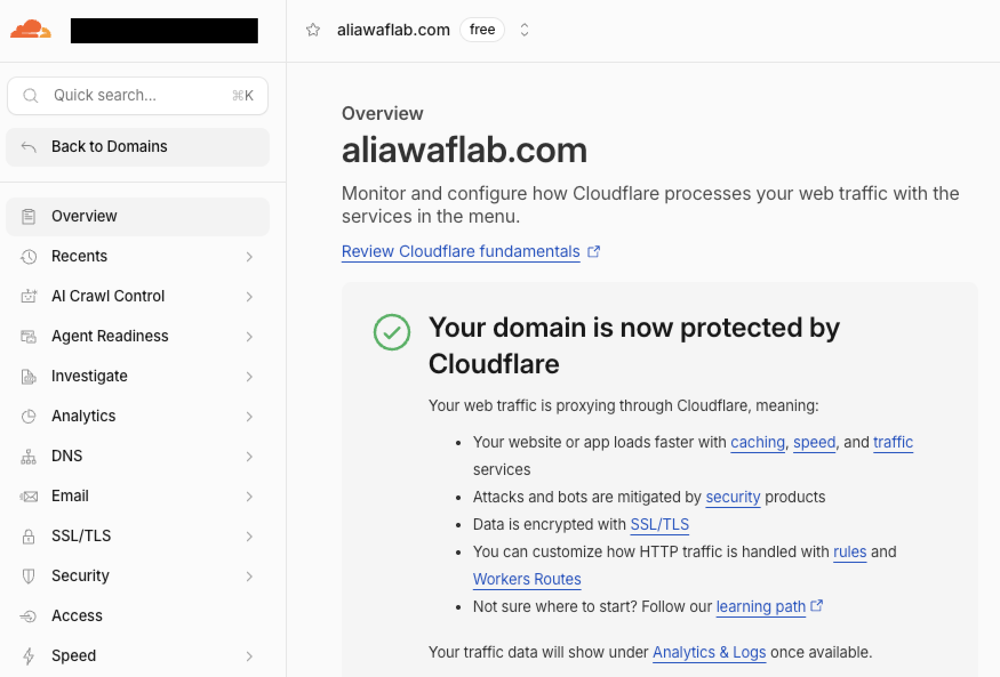

---

### Phase 3 – WAF Configuration

I reviewed Cloudflare's security settings and created a custom rule for an XSS test pattern sent to the application's search page.

📸 [View WAF configuration screenshots](Evidence/Polished/03-waf-configuration)

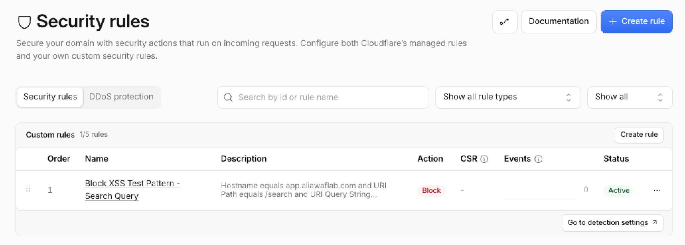

---

### Phase 4 – XSS Testing

I first sent a normal search to confirm that ordinary traffic worked. I then sent an authorized XSS test pattern. Cloudflare blocked the test request and recorded a security event.

📸 [View XSS testing screenshots](Evidence/Polished/04-security-testing)

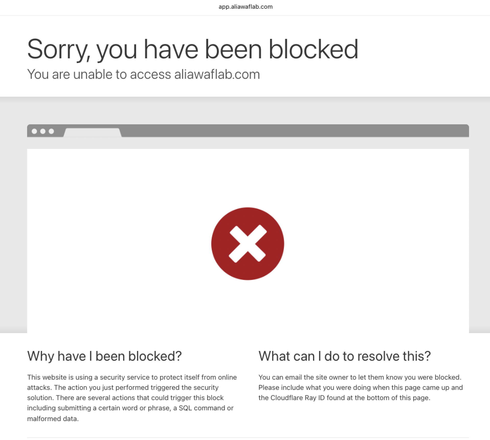

---

### Phase 5 – Event Investigation

I opened the XSS event in Cloudflare and reviewed the rule, action, hostname, path, request method, query string, and other request details. These details confirmed why the request was blocked.

📄 [View the incident report](docs/incident-investigation.md)

📸 [View event investigation screenshots](Evidence/Polished/05-event-analysis)

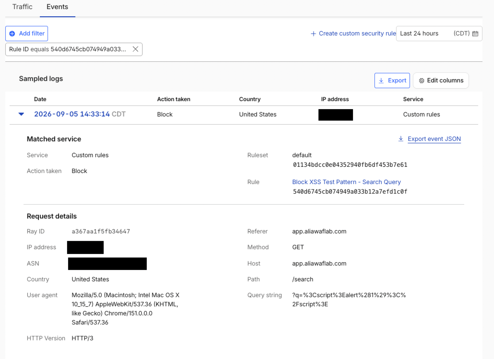

---

### Phase 6 – False Positive and Rule Tuning

The first XSS rule also blocked the normal search `javascript fundamentals` because it matched the broad word `script`. I made the rule more specific and tested it again.

After the change:

- The normal JavaScript search was allowed.
- The XSS test pattern was still blocked.

📸 [View rule-tuning screenshots](Evidence/Polished/06-rule-tuning)

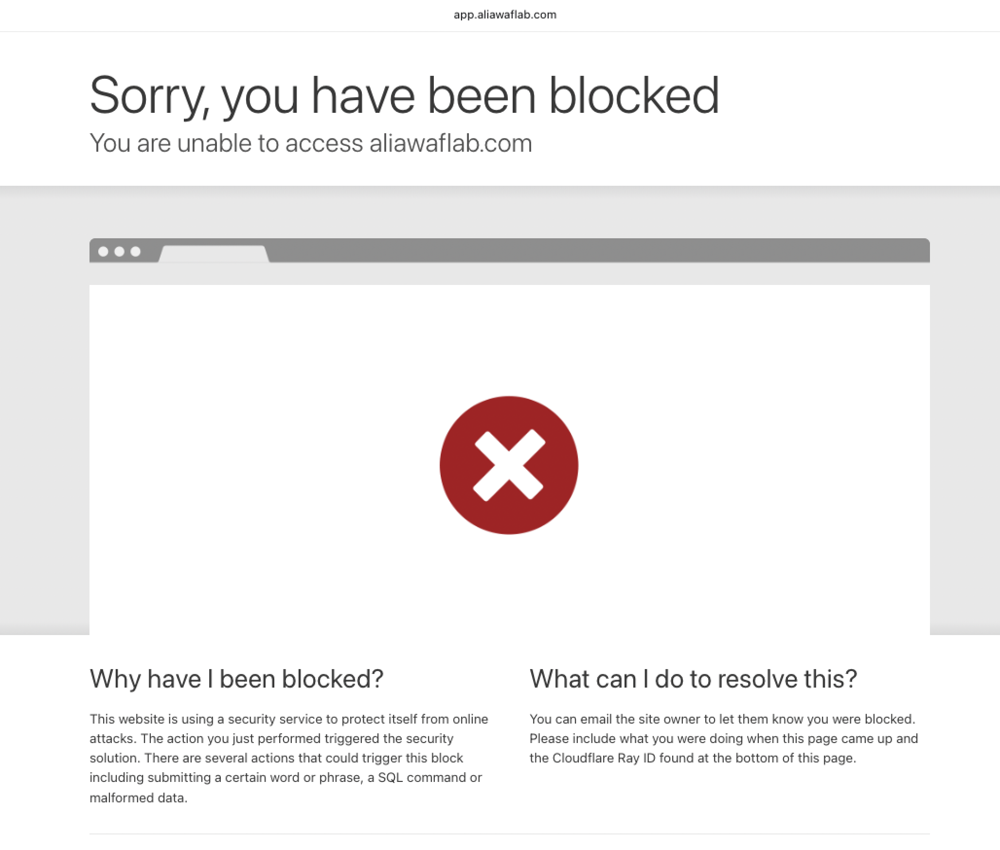

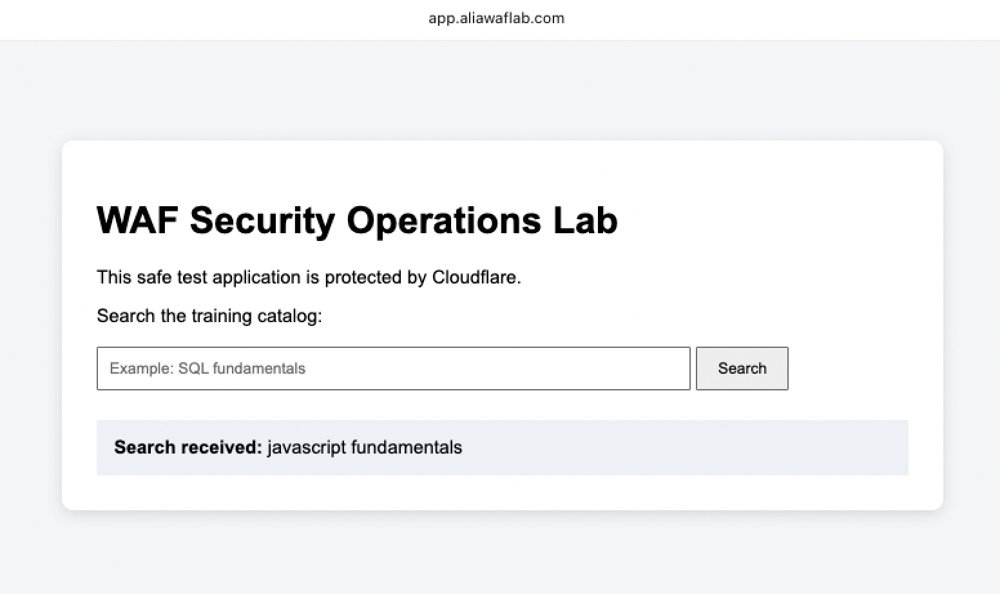

---

### Phase 7 – SQL Injection Testing

I created a second custom rule for an authorized `UNION SELECT` SQL injection test pattern. A normal SQL-related search was allowed, while the test pattern was blocked. I then reviewed the matching Cloudflare event.

📸 [View SQL injection screenshots](Evidence/Polished/07-sqli-operations)

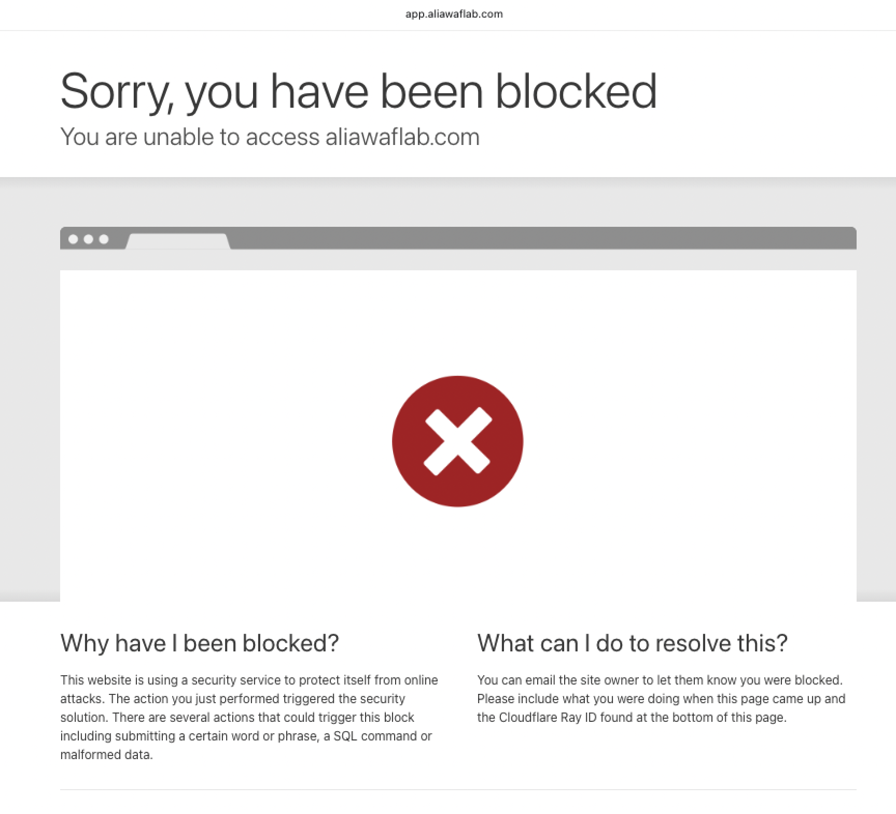

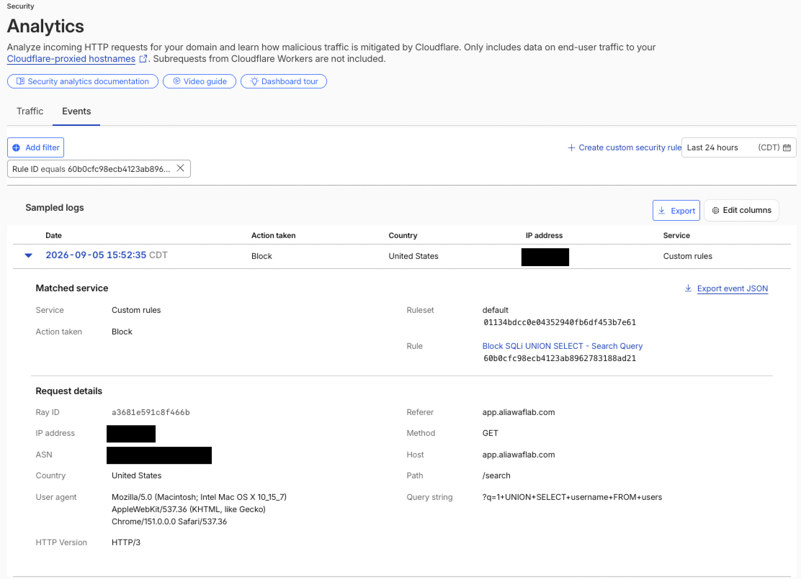

---

### Phase 8 – Rate Limiting

I created a rate-limiting rule for the search page. It allowed up to five requests in ten seconds from one IP address and temporarily blocked additional requests for ten seconds.

When I exceeded the limit, Cloudflare returned HTTP `429 Too Many Requests` and recorded the event.

📸 [View rate-limiting screenshots](Evidence/Polished/08-rate-limiting)

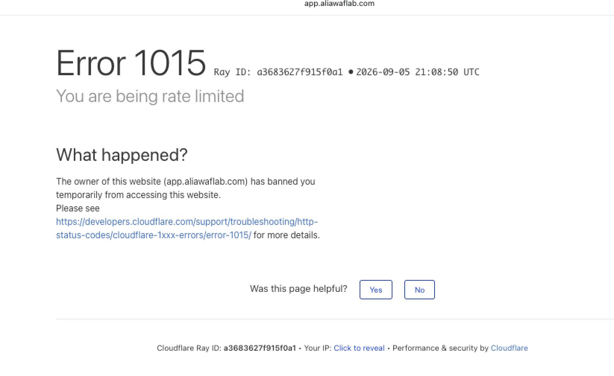

---

### Phase 9 – Burp Suite Testing

I used Burp Suite to view application traffic and resend controlled requests with Repeater. I compared the responses with the related Cloudflare events.

The results were:

- Normal request: HTTP `200 OK`
- XSS test: HTTP `403 Forbidden`
- SQL injection test: HTTP `403 Forbidden`
- Too many requests: HTTP `429 Too Many Requests`

📸 [View Burp Suite screenshots](Evidence/Polished/09-burp-suite)

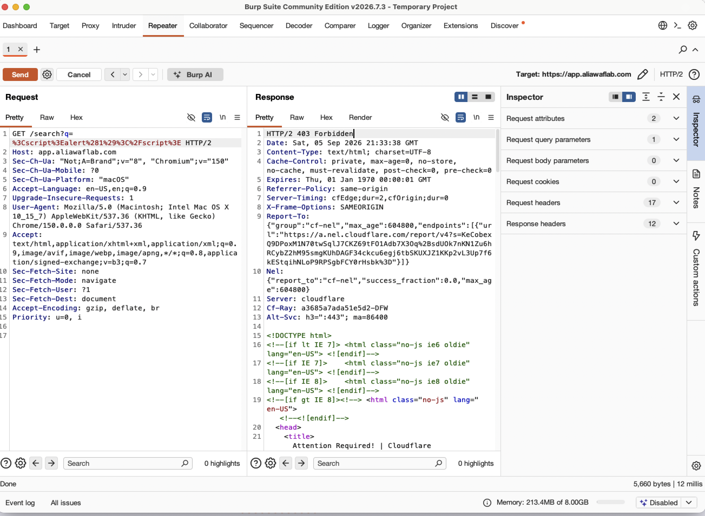

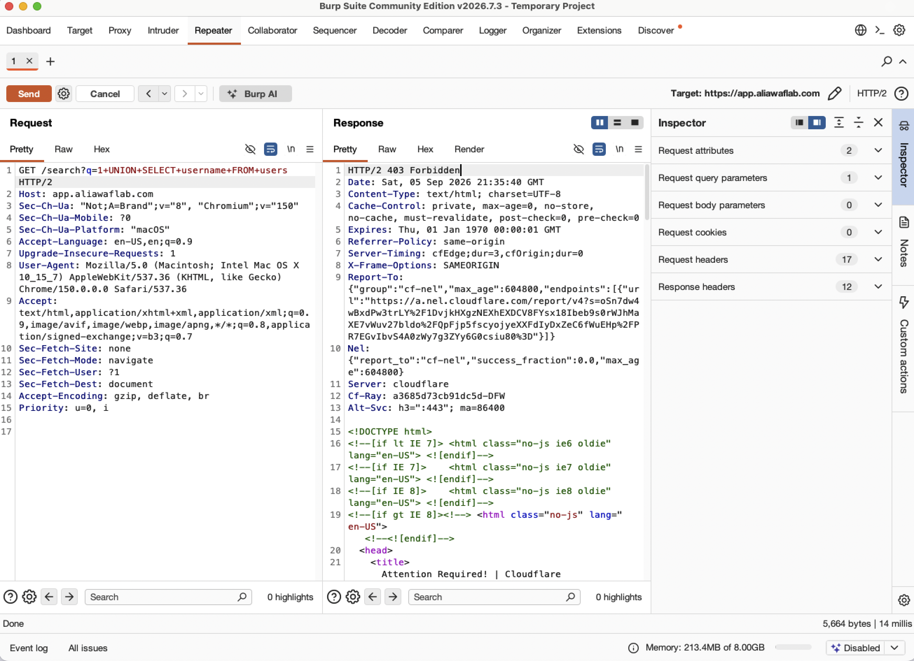

---

### Phase 10 – Terraform WAF Automation

I used Terraform to place the existing Cloudflare custom WAF ruleset under code-based management. I then added a small `terraform-test` blocking rule.

The basic workflow was:

1. Initialize Terraform and the Cloudflare provider.
2. Check and format the configuration.
3. Import the existing Cloudflare ruleset.
4. Use `terraform plan` to preview the proposed change.
5. Review and apply the change.
6. Confirm the new rule in Cloudflare.
7. Send a matching request and confirm that it was blocked and recorded.

The API token was entered through an environment variable and was not saved in the repository. Terraform state files were also excluded because they can contain sensitive information.

📄 [View the Terraform configuration](terraform)

📸 [View Terraform screenshots](Evidence/Polished/10-terraform-automation)

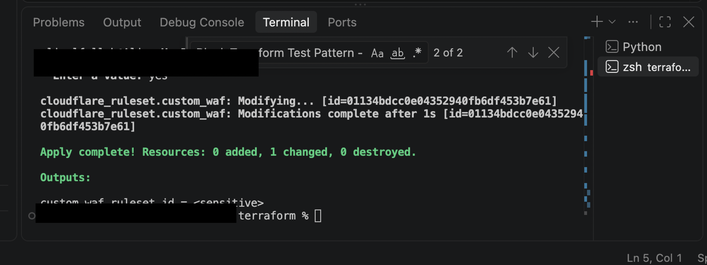

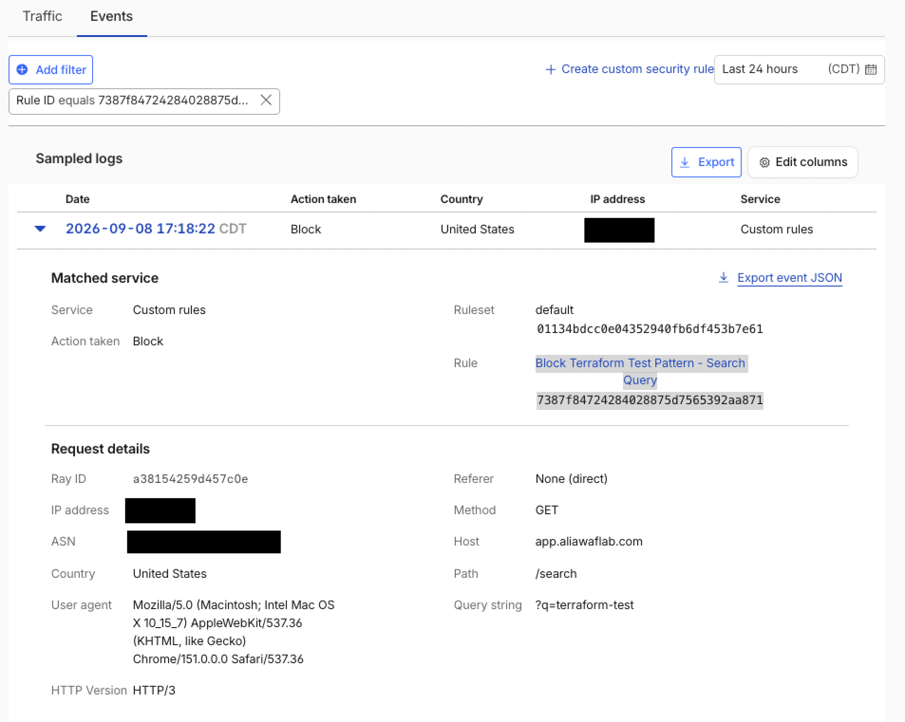

---

## Security and Privacy

- I tested only the application and domain created for this lab.
- The test application safely displayed submitted search text.
- The Cloudflare API token was not stored in the project.
- API tokens, Terraform state, variable-value files, and raw evidence were excluded from GitHub.
- Public screenshots were checked and sanitized to hide private information.

---

## Skills Practiced

- Onboarding an application to Cloudflare
- Creating and testing custom WAF rules
- Reviewing HTTP traffic and Cloudflare security events
- Investigating XSS and SQL injection alerts
- Finding and correcting a false positive
- Configuring and testing rate limiting
- Using Burp Suite to resend controlled requests
- Using Terraform to preview and apply a WAF change
- Documenting the investigation and protecting sensitive information

---

## Important Note

This was a controlled educational lab. All test patterns were used only against infrastructure that I owned and was authorized to test.
